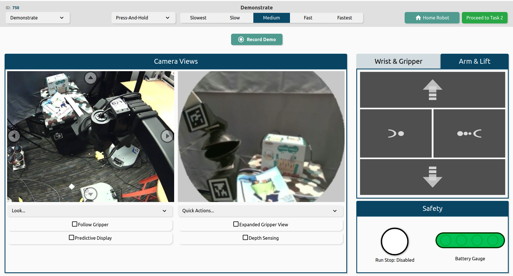
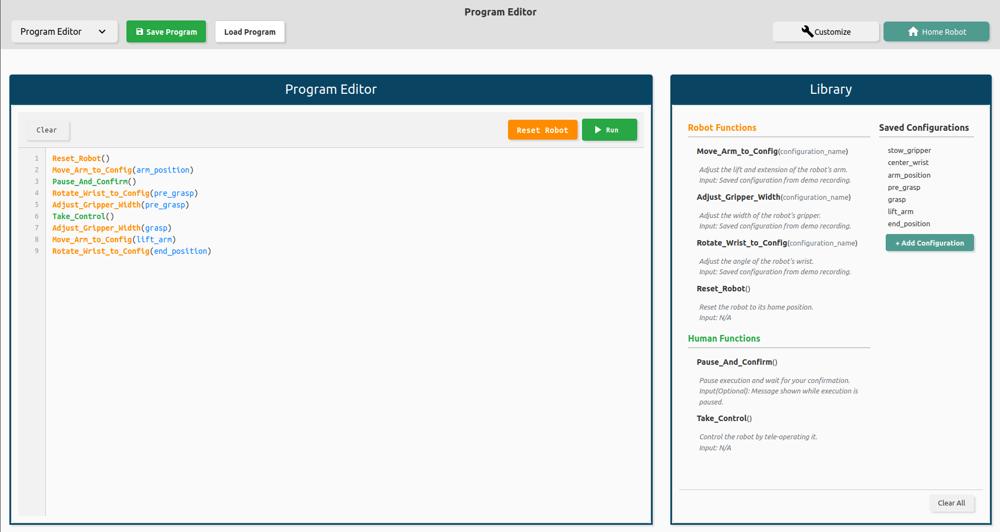
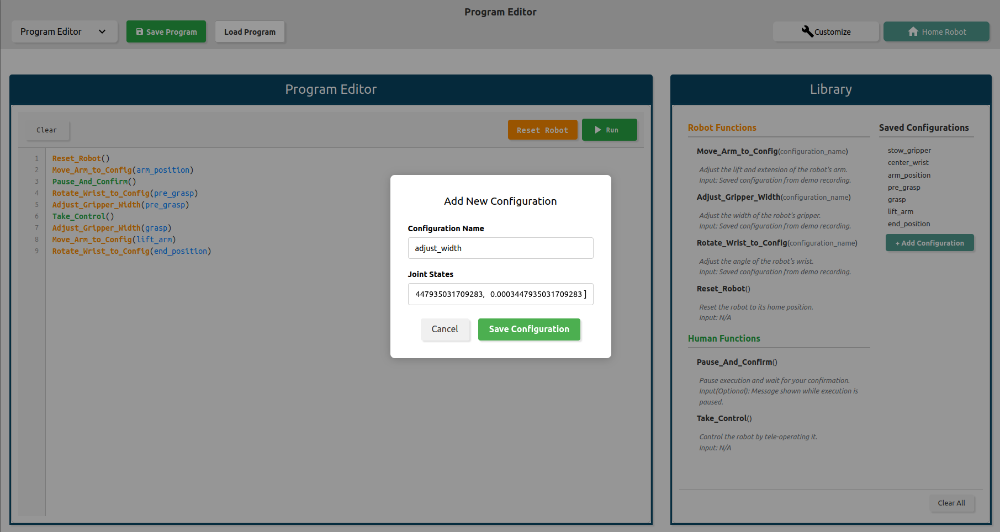
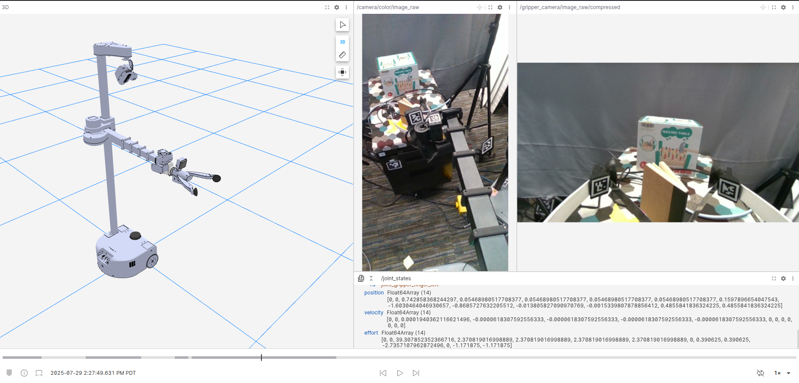
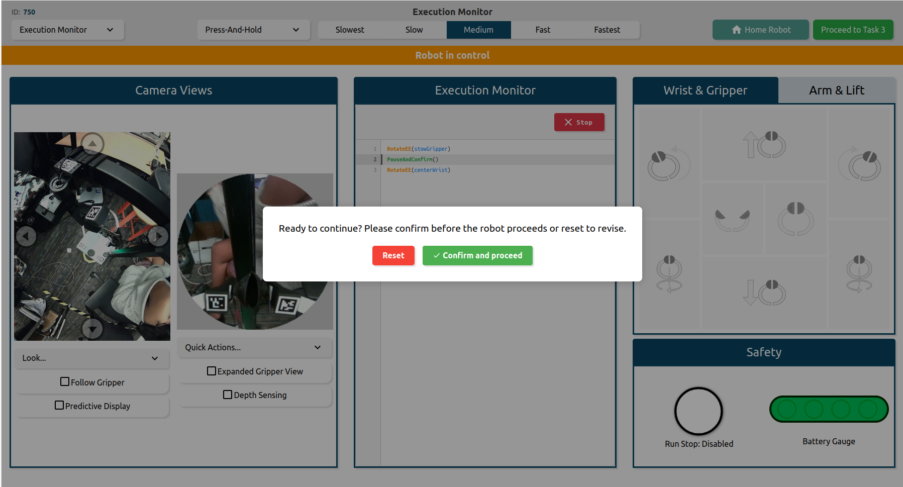
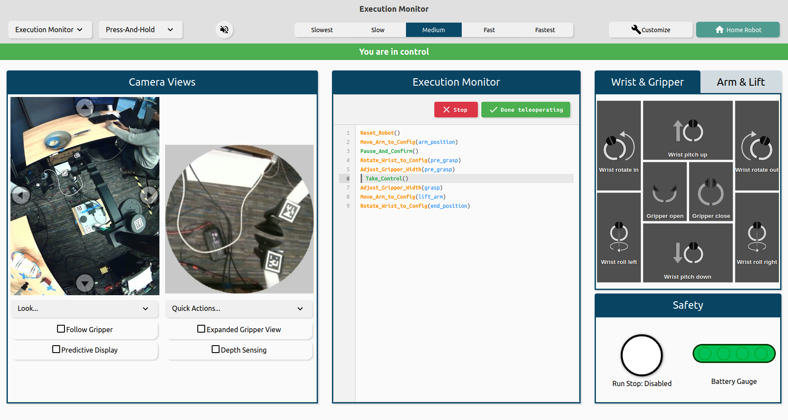

# Overview

This codebase provides a full-stack interface for **remotely teleoperating the Stretch robot**, **recording teleop demonstrations**, and **authoring shared autonomy programs** via a high-level API.

Originally adapted from the base [Hello Robot teleop interface](https://github.com/hello-robot/stretch_web_interface), this version extends functionality to support shared autonomy of the Stretch through end-user programming. The interface supports remote access using WebRTC and is built on ROS2, WebRTC, Nav2, and TypeScript.

# Setup & Installation

The interface is compatible with the Stretch RE1, RE2 and SE3. It currently only supports Ubuntu 22.04 and ROS2 Humble. Upgrade your operating system if necessary ([instructions](https://docs.hello-robot.com/0.3/installation/robot_install/)) and create/update the Stretch ROS2 Humble workspace ([instructions](https://docs.hello-robot.com/0.3/installation/ros_workspace/)). This will install all package dependencies. 

1. Create a new ROS2 workspace at ~/ros2_ws. Follow the official ROS2 tutorial for step-by-step guidance.([instructions](https://docs.ros.org/en/foxy/Tutorials/Beginner-Client-Libraries/Creating-A-Workspace/Creating-A-Workspace.html).
2. Clone this repository into ~/ros2_ws/src:
```
cd ~/ros2_ws/src
git clone <repo-url>
```
3. Install web interface dependencies:
```
cd ros2_ws/src/stretch_web_teleop
pip3 install -r requirements.txt
npm install --force
npx playwright install
```
4. Set up HTTPS certificates:
```
cd ros2_ws/src/stretch_web_teleop/certificates
curl -JLO "https://dl.filippo.io/mkcert/latest?for=linux/amd64"
chmod +x mkcert-v*-linux-amd64
sudo cp mkcert-v*-linux-amd64 /usr/local/bin/mkcert
CAROOT=`pwd` mkcert --install 
mkdir -p ~/.local/share/mkcert
rm -rf ~/.local/share/mkcert/root*
cp root* ~/.local/share/mkcert
mkcert ${HELLO_FLEET_ID} ${HELLO_FLEET_ID}.local ${HELLO_FLEET_ID}.dev localhost 127.0.0.1 0.0.0.0 ::1 
rm mkcert-v*-linux-amd64
cd ros2_ws/src/stretch_web_teleop
touch .env
echo certfile=${HELLO_FLEET_ID}+6.pem >> .env
echo keyfile=${HELLO_FLEET_ID}+6-key.pem >> .env
cd ros2_ws
```

You will need a [Foxglove account](https://app.foxglove.dev/signup) to replay recorded teleoperation demonstrations in order to create programs. Ensure the MCAP plugin is installed for Foxglove compatibility:
```
$ sudo apt-get install ros-humble-rosbag2-storage-mcap
```

## Installing Beta Teleop Cameras

To install the Beta teleop cameras, plug one camera in and run the following command:

```
REx_camera_set_symlink.py --list
```

You should see an output similar to:

```
For use with S T R E T C H (R) from Hello Robot Inc.
---------------------------------------------------------------------

Found the following Video Devices:


Intel(R) RealSense(TM) Depth Ca (usb-0000:00:0d.0-1):
Ports: ['/dev/video0', '/dev/video1', '/dev/video2', '/dev/video3', '/dev/video4', '/dev/video5', '/dev/media0', '/dev/media1']


USB CAMERA: USB CAMERA (usb-0000:00:14.0-1.1.1):
Ports: ['/dev/video6', '/dev/video7', '/dev/media2']
```

Note, it is important to make sure the cameras are not plugged in at the same time because they will have the same name: `USB CAMERA` and you will not be able to differentiate between the two. Next, set the camera symlink by running the following command:

```
REx_camera_set_symlink.py --port <PORT> --symlink <SYMLINK_NAME>
```

Replace `<PORT>` with the 0th element in the ports list for the `USB CAMERA` outputted by `REx_camera_set_symlink.py --list` command. In the example above, that would be `/dev/video6`. Replace `<SYMLINK_NAME>` with `hello-navigation-camera` or `hello-gripper-camera` for the navigation and gripper camera respectively. For example, if we were setting up the navigation camera the command would look similar to:

```
REx_camera_set_symlink.py --port /dev/video6 --symlink hello-navigation-camera
```

Repeat this process for both cameras, then run:

```
ll /dev/hello-*
```

and verify the symlinks are setup correctly.

# Launching the Interface

First, navigate to the folder containing the codebase using:

```
colcon_cd stretch_shared_autonomy
```

Next, launch the interface:

```
./launch_interface
```

If you'd like to launch the interface with a map run:

```
./launch_interface -m maps/<NAME_OF_MAP>.yaml
```

In the terminal, you will see output similar to:

```
Visit the URL(s) below to see the web interface:
https://localhost/operator
https://192.168.1.14/operator
```

Look for a URL like `https://<ip_address>/operator`. Visit this URL in a web browser on your personal laptop or desktop to see the web interface. Ensure your personal computer is connected to the same network as Stretch. You might see a warning that says "Your connection is not private". If you do, click `Advanced` and `Proceed`.

Once you're done with the interface, close the browser and run:

```
./stop_interface.sh
```

If you encounter any issues with missing certificates, copy the certificates from your ament_ws install to your ros2_ws install.
```
cp -r ~/ament_ws/install/stretch_web_teleop/share/stretch_web_teleop/certificates/* ~/ros2_ws/install/stretch_web_teleop/share/stretch_web_teleop/certificates/
```

**Note:** Only one browser can be connected to the interface at a time.


# Usage Guide

The web interface includes three modes: Demonstration Recorder, Program Editor, and Execution Monitor. You can navigate between them using the dropdown menu located on the left side of the header. This tutorial will walk you through how to use each mode.

## Demonstration Recorder

There are three panels. The `Camera Views` panel contains the wide angle and gripper camera views. The second panel has three tabs: (1) `Base`, (2) `Wrist & Gripper`, and (3) `Arm & Lift`. Each of these tabs contains a button pad for controlling the respective joints. The `Safety` panel contains the run stop and battery gauge. The `Record Demo` button will allow you to record demonstrations of the robot being teleoperated. The header contains a drop down for three action modes, the speed controls (`Slowest`, `Slow`, `Medium`, `Fast`, and `Fastest`), and a `Home Robot` button to reset the robot to its home position. 


### Quick Look

There are three built-in quick look options: `Look Ahead`, `Look at Base` and `Look at Gripper`.

### Gripper Camera View

There are two quick actions for the gripper camera view: (1) `center wrist` and (2) `stow wrist`. Center wrist will turn the wrist out and align it with the arm. Stow wrist will rotate the wrist to the stow position.

### Button Pads

Each button pad controls a different set of joints on the robot. When you click a button the robot will move and the button will highlight blue while the robot is moving. The button will turn red when the respective joint is at its limit.

### Action Modes

The action modes can be selected in the dropdown in the top-left corner of the interface. The action modes provides varying degrees of discrete and continuous control.

- **Step Actions**: When you click, Stretch will move a fixed distance based on the selected speed.
- **Press-Release**: Stretch will move while you are pressing and holding the button and will stop when you release.
- **Click-Click**: Stretch will start moving when you click and will stop when you click again. You can also stop Stretch by moving the cursor outside the button you clicked.

### Record Demo

To record demonstrations, press the `Record Demo` button and teleoperate the robot using the button pads as you normally would. The robot’s data will be saved locally as a rosbag, which you can later upload to Foxglove and reference when writing your program.
In order to save these rosbags to a specific folder, you can change the output directory in [server.js](https://github.com/sahithav/stretch_shared_autonomy/blob/faaaa502754c426d90ae845e2a992df39aeae45d/server.js#L161C3-L161C80). 

## Program Editor 
The program editor consists of two panels. The `Program Editor` allows you to write and execute programs on the robot. The `Library` contains available functions and saved configurations. Configurations can be added by referencing a recording. 
The `Reset Robot` button resets the robot to its home position without performing the full homing process (useful if you want to re-run a program).



You can use any of the functions listed in the Library. `Robot Functions` correspond to actions that can be executed autonomously by the robot. `Human Functions` correspond to actions that require user input during execution. Saved configurations provide input values for these functions. Clicking on a function or configuration will automatically insert it into the Program Editor. Comments can also be added directly within the editor.

### Robot Functions 
- Move_Arm_to_Config(configuration_name): Move the arm and wrist of the robot to specified joint state configuration
- Adjust_Gripper_Width(configuration_name): Open or close the gripper to specified width configuration
- Rotate_Wrist_to_Config(configuration_name): Move the wrist of the robot to specified orientation
- Reset_Robot(configuration_name): Return the robot to its default configuration

### Human Functions 
- Take_Control(): Stop program execution and switch to teleoperating the robot mid-program to correct its behavior if needed
- Pause_And_Confirm(): Pause the program to inspect the robot mid-execution before resetting or proceeding with the remaining commands

### Saved Configurations 
Saved configurations are stored joint positions of the robot that serve as inputs to functions. They can be copied from Foxglove (explained below) and added through the `Add Configuration` button. Configurations are stored under a chosen name and can then be used within programs.


### Saving and Loading Programs 
Programs can be saved and reloaded for later use. This feature, available through the header buttons, saves both the program and its associated configurations. Once reloaded, the program can be run on the robot in a new session. 

## Demonstration Replayer 
Using your Foxglove account, open a previously recorded rosbag to reference during program creation. After opening the file, you can customize the the layout with panels ([details](https://docs.foxglove.dev/docs/visualization/panels)). We recommend:
- A 3D panel
    - In order to visualize the robot, you will need to manually add a `URDF layer` to the 3D panel. You can add the corresponding raw github link to your Stretch Robot ([urdf](https://github.com/hello-robot/stretch_urdf/tree/main/stretch_urdf/SE3)).
- Two Image panels (for /camera/color/image_raw and /gripper_camera/image_raw/compressed)
- A Data Source panel (to display /joint_states
Use the scrubber to play through the recording. When you reach a desired position, copy the `position` array in the Data Source panel for /joint_states. This array corresponds to the robot’s joint positions and can be used as a saved configuration.


## Execution Monitor 
The Execution Monitor contains three panels: `Camera Views`, `Execution Monitor`, and the teleoperation controls. The Execution Monitor  lets you run your program, reset the robot, and displays your program line by line as it executes. 

If a Human Function is called, you will be prompted to provide input:
- When `Pause_And_Confirm()` is reached, a popup appears asking if the program should continue.
  

- When `Take_Control()` is reached, teleoperation controls are enabled. You can use the button pads to control the robot, then click `Done Teleoperating` to resume execution.
  



