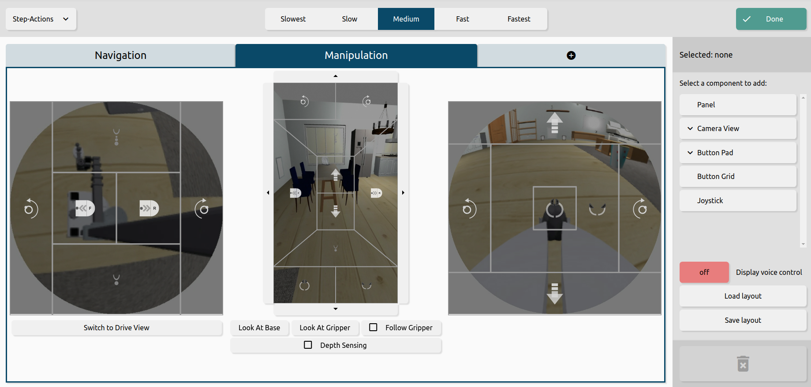

# Operator Page

The operator page is what users see while teleoperating the robot.

For more detailed info on the operator page logic and directory file structure see [documentation here](./tsx/README.md).

## Operator Page

## Component Hierarchy

Below is a diagram showing the hierarchy between components in the operator page.

- Header
  : fixed at the top of the screen, this displays controls that the user always has access to

  - Action Mode
    : dropdown on the left of the header to switch between step-actions, press-release, and click-click action modes
  - Speed Control
    : Set of buttons labeled from "slowest" to "fastest" which control the scaling of the robots speed for all joints and all controls
  - Customize button
    : button on the right side of the header which enters/leaves customization mode

- Voice Controls
  : component below the header and above the layout, allows the user to activate a microphone with voice controls of the interface

- Sidebar
  : the vertical menu on the right side of the page which is only displayed while in customize mode. The top of the sidebar shows the currently selected element, or "none" if nothing is selected.

  - Component Provider
    : visible when no elements are selected from the layout, this is the upper area in the Sidebar which allows users to choose an element to add into the layout
  - Display voice controls
    : option to display or hide the voice controls

- Layout
  : the area where the user has control over the elements inside. The user can add, remove, or modify elements in the layout

  - Panel
    : a component which contains one or more tabs
  - Tab
    : a component which contains one or more controls or camera views
    - Camera view
      : a video element showing a live stream from one of the robot's cameras
      - Predictive display
        : a special control which can only be placed over the overhead camera view. It draws a curve from the base to the cursor showing the path the robot will take if the user clicks at a location on the camera view.
    - Joystick
      : a virtual joystick which can be used to control the base
    - Button Pad
      : a set of buttons which can be placed independently or over a camera view
